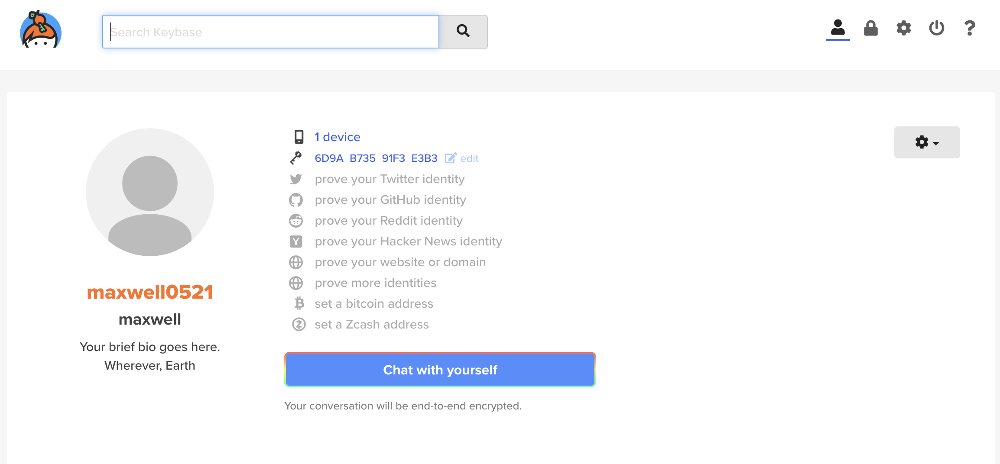
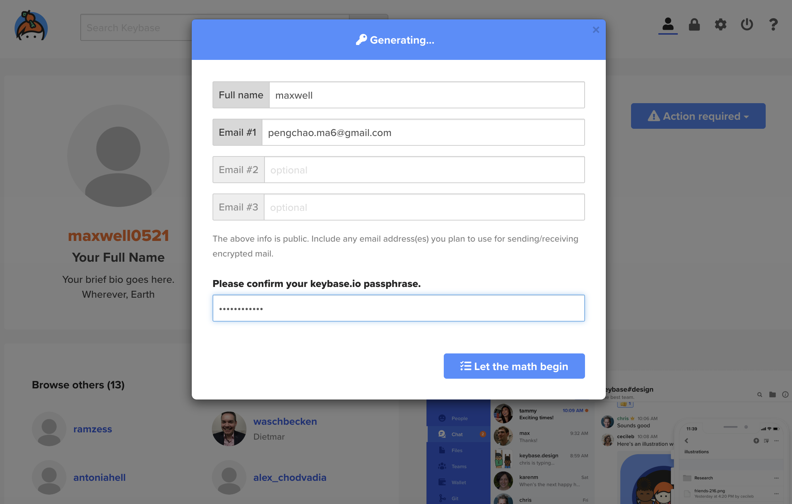
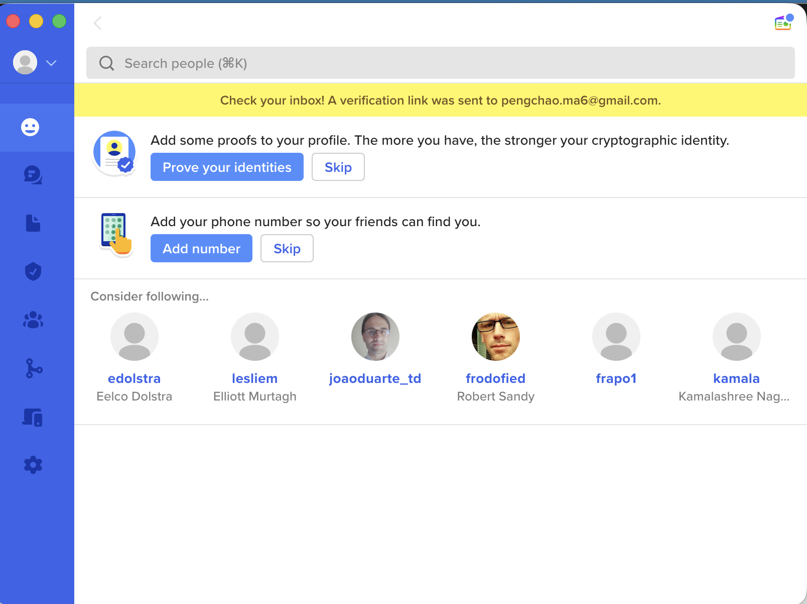
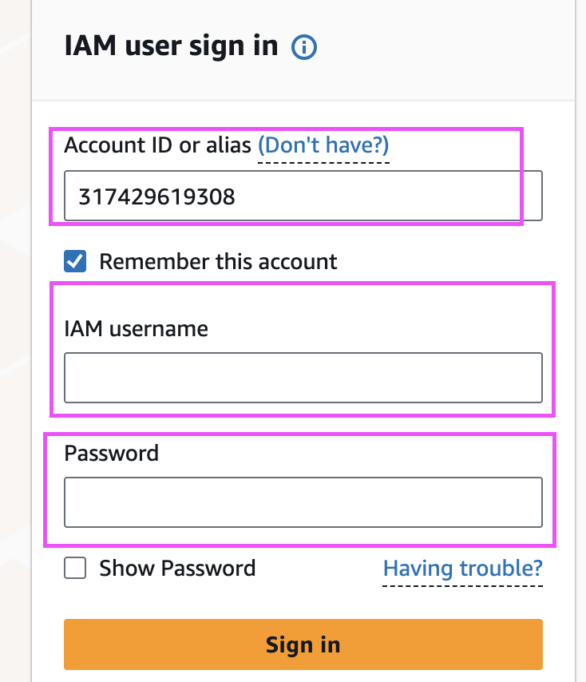

# aws-terraform-create-iam-user
This repository demo is used for AWS admins, DevOps, SRE who manage the AWS IAM Users. the terraform will automatically create IAM users and groups and assign perssions for users, aws_account_id and user_id and credentials will be created for new iam users


## Usage

- For security perspect we need to use gpg key to entrypt the credentials

- Firstly register your account on keybase.io , keybase is opensource and totally free 

  

- Follow the add pgp key on keybase
  and confirm your kaybase passphrase using your password once you register keybase

  

- Install Keybase APP on your Mac 
  download and install

  

- Convert the transfer format into a raw binary data file e.g. initial_password.gpg

```shell
allen@192 Downloads %  echo "wcBMA0M1JwC4xhDwAQf9Gl8xoBhj0trql2k00BQpYr6mnbhXDGP5djwroTvFkRAnnmyBdWTvltuyldb1TOVdU37A5PKn9RUDf3kMf9QNBhl7knK9Aq1uLRGJ97tAH4QuVyAzJ9eN/q4CiRknuWixtQ2SpaufbbeABdbaVpQ3eOuZ0m3/iqPesB80iJqqhHd0oLalug6YCi83bH0fJEG8oHQG2yhkYJLUM9HmOLuVqy1THZ2Nkh1R+GC0/4LlF144jPW0g4ZqYlAEFyFULVMmxr60XBr+c0EvZDJ5kdNPs+/3imAAxsgCwWzjdyfY89x45JzO95oxLan26IGPPb66eGKA32664/axd1/oiBaM95tJFAV0Xg3gDtlam0XyKNUH1YNNzNzgzmT7uEHR3nqhZCzzRLngzeEmQffzaJM/5uwNh7uSVt11nqlhoPMKxceYZPw3QA9Zm" | base64 -d > initial_pass.gpg

```

- Let the gpg program once installed on your laptop use the private key to decrypt the binary file and output the plaintext

```shell
allen@192 Downloads % gpg --decrypt initial_pass.gpg
gpg: encrypted with rsa2048 key, ID 43352700B8C610F0, created 2026-06-09
      "maxwell <pengchao.ma6@gmail.com>"
XvkxbxyQ=pO4_svbp(et         # this is the plaintext initial password

- You can also get all IAM users plaintext initital password 

```shell
allen@192 Downloads % cat credentials.json | jq -r 'to_entries[] | .value.username + ":" + .value.encrypted_password' | while IFS=: read -r user pass; do
    echo -n "username: $user -> "
    echo "$pass" | base64 -d | gpg --decrypt 2>/dev/null
    echo ""
done > all_passwords.txt

allen@192 Downloads % cat all_passwords.txt 
username: jiajia.xiao -> XvkxbxyQ=pO4_sv990(et
username: kate.winslets -> lu)3T@Vw998706U^Mn5VAsJ
username: sean.lim -> +bbc(5^m&vf_k90085m=G#9UUi
username: sophia.zhao -> zFh-}$w&dp+KX@}UeUYT98W3j
allen@192 Downloads % 

- Check IAM user initial password ( user must changed this password on their first time login)




